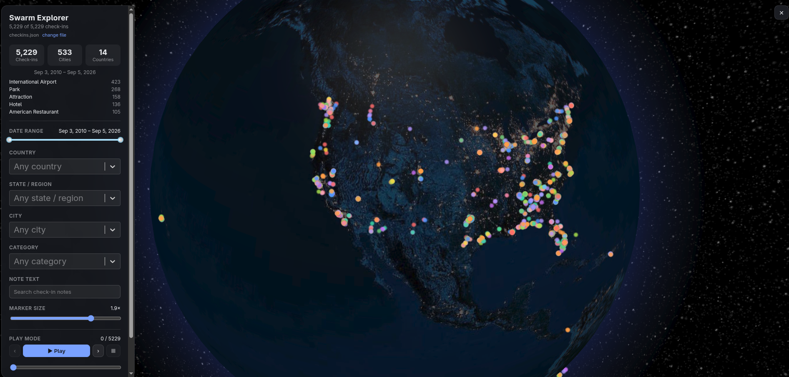

# Swarm Check-in Explorer

Explore your check-ins here: [https://airalcorn2.github.io/swarm-explorer/](https://airalcorn2.github.io/swarm-explorer/).

A web app for exploring your personal Swarm / Foursquare check-in history on a 3D globe: date-range filtering, cascading location/category filters, and a **play mode** that reveals your check-ins one at a time in chronological order while you freely pan and zoom the globe.

It runs **entirely in your browser**.
You pick your export file locally and it's parsed client-side — nothing is uploaded, there is no backend, and the app never calls the Foursquare API.
Because of that, the app itself is safe to host as a static site: anyone can open the URL and explore their own data.



---

## Using it

1. Open the app (a hosted copy, or run it locally — see below).
2. Click **Choose your check-ins file** and select your export JSON, or **Try the sample data** to look around first.
3. The file is normalized in the browser and cached (IndexedDB) so a reload keeps it. **change file** in the panel clears it and any cached copy.

Accepted file shapes:

- a bare JSON array of check-in objects
- `{ "items": [...] }`
- one or more raw Foursquare API response pages (`{ "response": { "checkins": { "items": [...] } } }`)

---

## Getting your check-in data

`scripts/fetch_checkins.py` walks the Foursquare v2 `/users/self/checkins` endpoint from newest to oldest and dumps your entire history to one file.
It pages with `beforeTimestamp` rather than `offset`, because Foursquare caps offset-based paging at a few hundred results and then just repeats the first page — a paginator that trusts `offset` silently stops at ~250 unique check-ins.

Needs `pip3 install -r requirements.txt` (just `requests`).
You supply your own app's values — the URLs below contain **placeholders you must replace**, they will not work as-is.

1. Create an app at <https://foursquare.com/developers/apps>.
   Note its **Client ID**, and set a **Redirect URI** (any URL that's yours, e.g., `https://localhost/callback` — it never has to actually serve a page).
2. In a browser logged into Foursquare, visit the authorize URL below, with `YOUR_CLIENT_ID` replaced by your Client ID and `YOUR_REDIRECT_URI` replaced by the exact Redirect URI you registered (URL-encoded):

   ```
   https://foursquare.com/oauth2/authenticate?client_id=YOUR_CLIENT_ID&response_type=token&redirect_uri=YOUR_REDIRECT_URI
   ```

   Example, for Client ID `ABC123` and redirect URI `https://localhost/callback`:

   ```
   https://foursquare.com/oauth2/authenticate?client_id=ABC123&response_type=token&redirect_uri=https%3A%2F%2Flocalhost%2Fcallback
   ```
3. Approve.
   The browser redirects to `YOUR_REDIRECT_URI#access_token=...` — the page itself may fail to load, but copy the `access_token` value from the address bar.
4. Run:

   ```bash
   export FSQ_TOKEN=<the access_token you copied>
   python3 scripts/fetch_checkins.py --out checkins.json
   ```

   The script prints a running count as it walks back in time; the final number should match your Swarm profile's lifetime check-in total.

If an export from another tool only holds ~250 check-ins (or just the last few months), it was truncated by the offset cap above — re-fetch with this script.
The app flags this too: the panel warns when a file has far more rows than unique check-ins.

---

## Running locally

```bash
npm install      # also copies the Earth textures into public/textures/
npm run dev      # http://localhost:5173, hot-reload
```

Or build and serve the static output:

```bash
npm run build    # -> dist/
npm run preview  # serves dist/ at http://localhost:4173
```

`./run.sh` does the build + preview in one step.

---

## Hosting your own copy

The build in `dist/` is plain static files with relative asset paths, so it works from a domain root or a sub-path.

**GitHub Pages** — [.github/workflows/deploy.yml](.github/workflows/deploy.yml) builds and deploys on every push to `main`.
One-time setup: repo **Settings → Pages → Build and deployment → Source: GitHub Actions**.
The app then lives at `https://<user>.github.io/<repo>/`.

**Netlify / Cloudflare Pages / any static host** — build command `npm run build`, publish directory `dist`.

No configuration or secrets are needed — there's nothing server-side and no personal data in the build.

---

## How it works

```
your export.json ──► src/normalize.ts ──► Dataset ──► React app ──► react-globe.gl
  (file picker)       flatten · dedupe    {checkins,   filters ·      (three.js)
   in-browser         · compute bounds     meta}       play mode
                             │
                        IndexedDB (so a reload keeps it)
```

- **`src/normalize.ts`** — parses the raw export and flattens each check-in; drops ones with no usable lat/lng, de-duplicates by id, computes the date bounds and the distinct city/state/country/category sets.
- **`src/hooks/useDataset.ts`** — owns the single loaded dataset: restores it from IndexedDB on start, or hands control to `DataLoader` (the file picker).
- **`src/filters.ts`** — all filtering (date range, cascading country/state/city, category) and the summary stats.
- **`src/hooks/usePlayback.ts`** — chronological playback over the *filtered* set.
- **`src/components/GlobeView.tsx`** — wraps `react-globe.gl`, progressively reveals visited markers during playback, and pulses a ring on the current / selected check-in. The camera is never moved programmatically — you always control rotation and zoom.
- Filter state is mirrored to the URL query string, so a particular view can be bookmarked.

### Normalized check-in shape

```ts
{
  id, timestamp /* unix s */, date /* ISO, UTC */,
  lat, lng, venueName,
  city, state, country,   // nullable
  category,               // top-level Foursquare category, nullable
  shout                   // nullable
}
```

---

## Notes

- The Earth textures are copied out of the `three-globe` package into `public/textures/` on `npm install` (see `scripts/copy-textures.mjs`), so the globe needs no network access at runtime.
- Rendering is one marker per filtered check-in — comfortable into the low thousands; past that you'd want clustering (not implemented). Use the date/location filters to thin a very large history.
- `scripts/make_sample.py` regenerates `public/checkins.sample.json` (the "Try the sample data" dataset).
